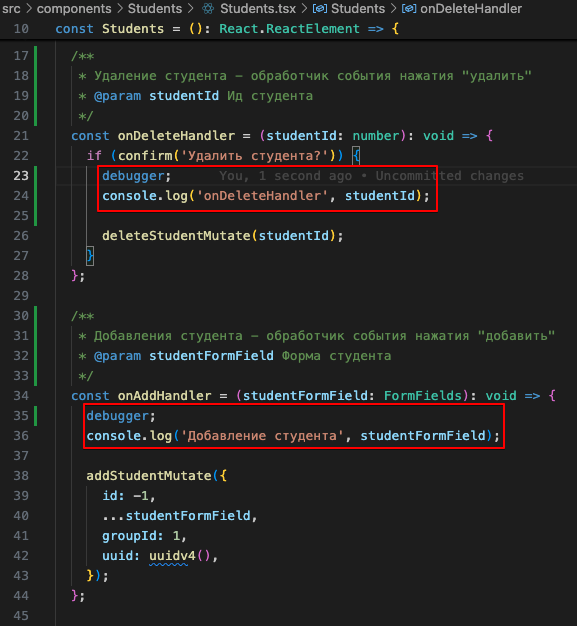
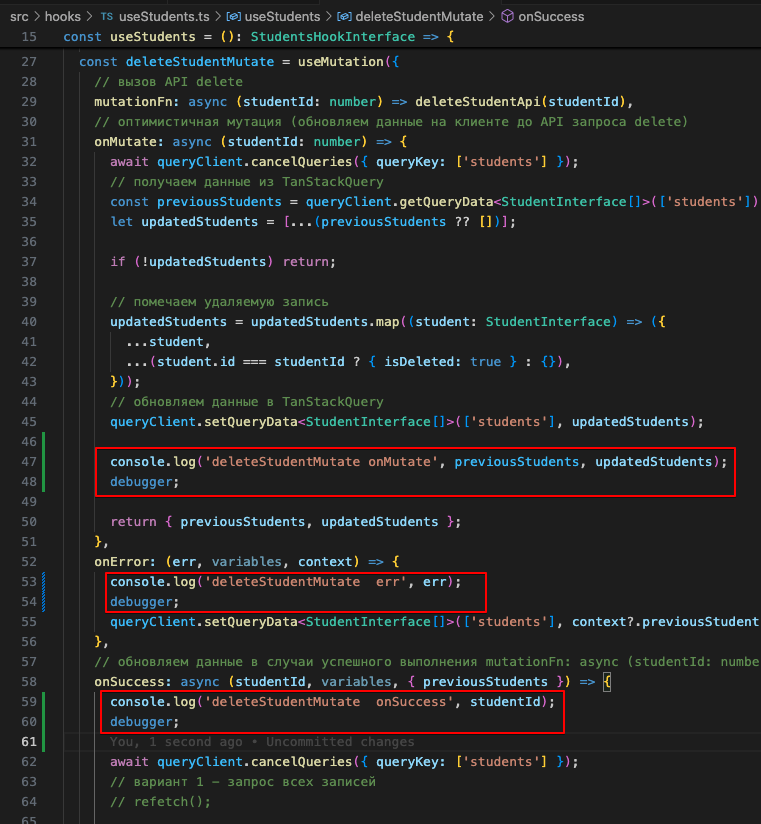
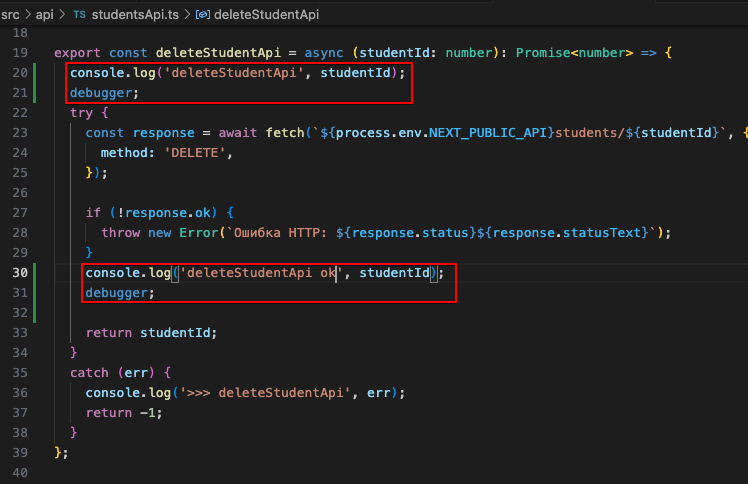
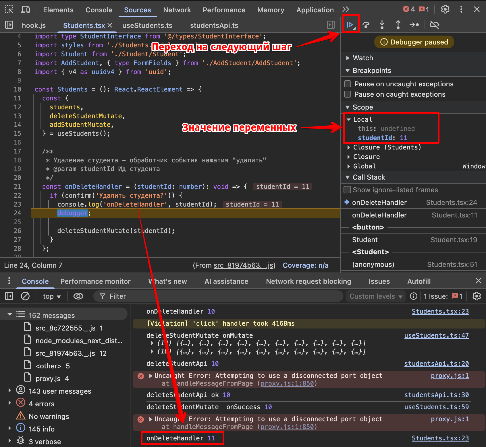
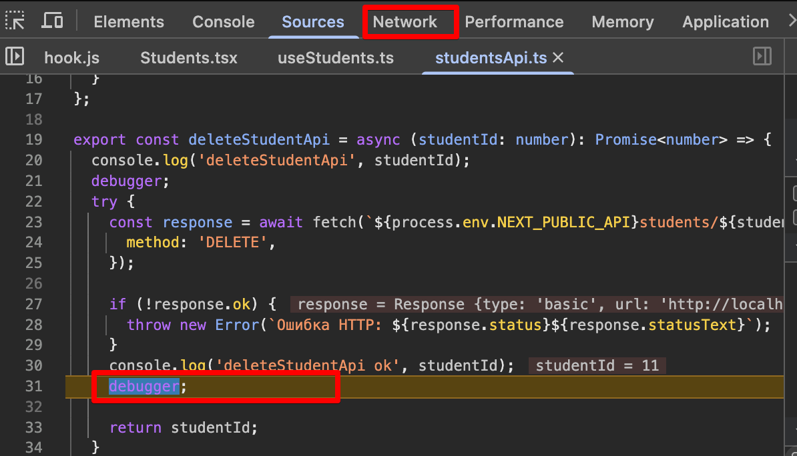
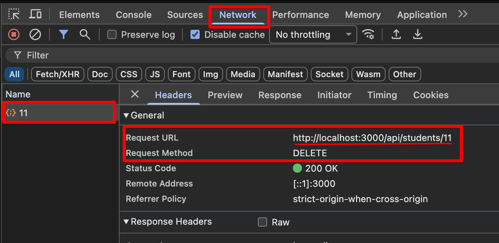

[<<< назад](../README.md)

# Debug - отладка, средства разработки браузера

- ### Открыть файл - src/components/Students/Students.tsx
- ### Добавить строки debugger и console.log

   

- ### Открыть файл - src/hooks/useStudents.ts
- ### Добавить строки debugger и console.log
  
   

- ### Открыть файл - src/api/studentsApi.ts
- ### Добавить строки debugger и console.log
  
   

- ### запустить проект - npm run dev
- ### F12 -  Открыть средства разработки в Google Chrome или другом браузе (command + option + i для MacOS)
- ### удалить студента в приложении

   

- ### при остановке в файле studentsApi
  
   

- ### открыть вкладку "Network"
  
   
