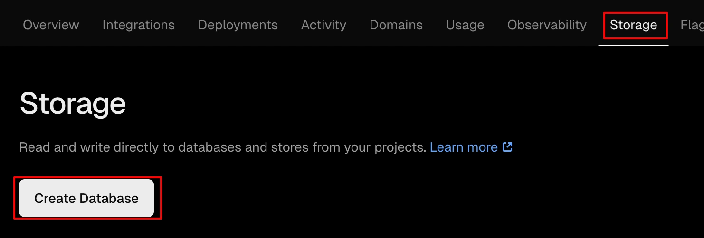
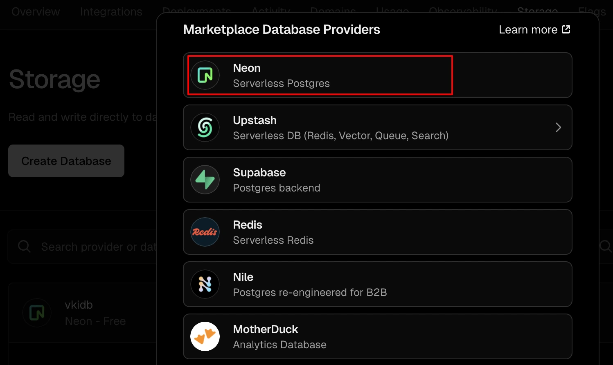
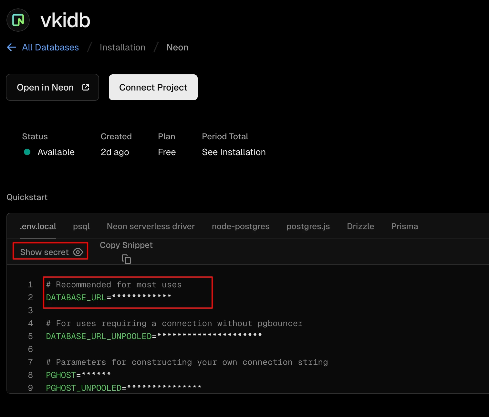

[<<< назад](../README.md)

- [Подключение облачной ДБ Postgres с Vercel](#подключение-облачной-дб-postgres-с-vercel)
  - [vercel.com](#vercelcom)
  - [Создание БД](#создание-бд)
    - [Раздел Storage](#раздел-storage)
    - [Выбор типа хранилища - Neon Serverless Postgres](#выбор-типа-хранилища---neon-serverless-postgres)
    - [Connection string](#connection-string)
  - [Настройка соединения проекта с облачной БД](#настройка-соединения-проекта-с-облачной-бд)
    - [Конфигурация](#конфигурация)
      - [.env](#env)
    - [Инициализация](#инициализация)
    - [Тестовые данные](#тестовые-данные)


# Подключение облачной ДБ Postgres с Vercel

## vercel.com
Зайти на https://vercel.com - бесплатный хостинг, позволяет размещать NEXT.js проекты

Пример https://vki-next.vercel.app

## Создание БД

### Раздел Storage


### Выбор типа хранилища - Neon Serverless Postgres


### Connection string
Копируем CONNECTION_URL



## Настройка соединения проекта с облачной БД

Скопировать к себе в проект файлы
- src/db/AppDataSource.ts
- Папка src/services
- Папка src/app/api/db
- api/groups/add-test
- api/students/add-test
- api/auth/add-test
- package.json

Выполнить
```
npm i
```

### Конфигурация

#### .env

- Добавить параметр POSTGRES и скопировать в него Connection string 
- Закомментировать параметр DB

```
POSTGRES="postgresql://neondb_owner:xxxxxxxxx.c-3.us-east-1.aws.neon.tech/neondb?sslmode=require"
# DB="g:/vki-web/vki-web-orm.db"
NEXT_PUBLIC_API="http://localhost:3000/api/"
JWT_SECRET="vki-next-jwt-secret-2025"
PASSWORD_SECRET_KEY="vki-next-password-secret-2025"
```

### Инициализация 
Для инициализации бд доступен раут http://localhost:3000/api/db/init


### Тестовые данные
Для добавления тестовых данных доступны следующие рауты:

http://localhost:3000/api/groups/add-test

http://localhost:3000/api/students/add-test

http://localhost:3000/api/auth/add-test
