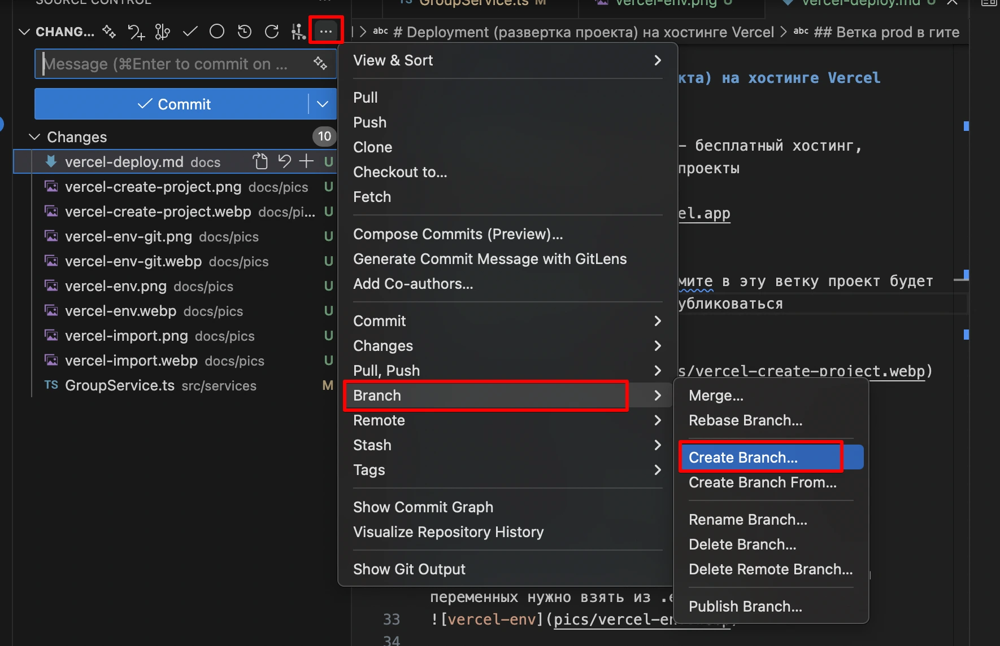
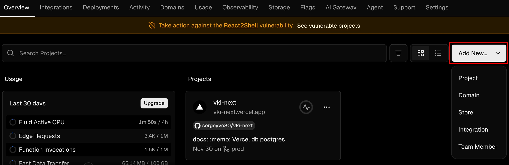
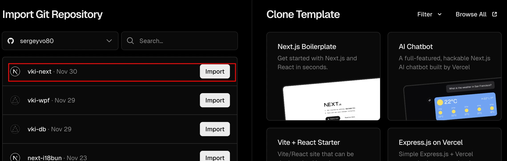
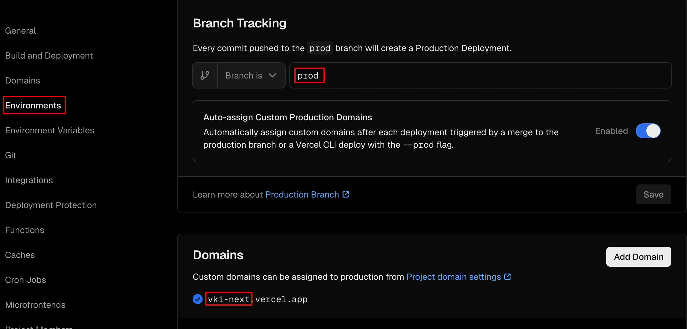
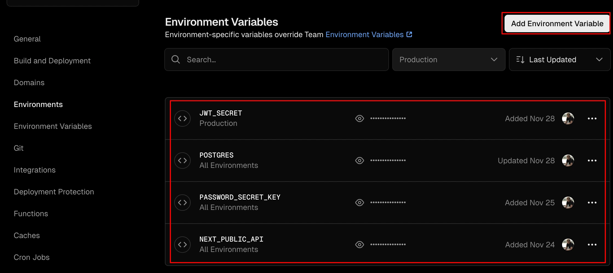

[<<< назад](../README.md)

- [Deployment (развертка проекта) на хостинге Vercel](#deployment-развертка-проекта-на-хостинге-vercel)
  - [Prod сборка](#prod-сборка)
  - [Ветка prod в гите](#ветка-prod-в-гите)
  - [vercel.com](#vercelcom)
  - [Создание проекта](#создание-проекта)
  - [Импорт из гитхаба](#импорт-из-гитхаба)
  - [Выбор гит ветки для сборки](#выбор-гит-ветки-для-сборки)
  - [Переменные окружения](#переменные-окружения)


# Deployment (развертка проекта) на хостинге Vercel

## Prod сборка

Запустить локально prod сборку
```
npm run build
```

Если возникнут ошибки в коде нужно их исправить, иначе проект не соберется

Либо можно временно игнорировать ошибки ESLint и TypeScript при сборке проекта в next.config.ts


```typescript
import type { NextConfig } from 'next';

const nextConfig: NextConfig = {
  /* config options here */
  eslint: {
    ignoreDuringBuilds: true,
  },
  typescript: {
    ignoreBuildErrors: true,
  },
};

export default nextConfig;
```

## Ветка prod в гите
Создайте ветку prod, при коммите в эту ветку проект будет автоматически собираться и публиковаться


## vercel.com
Зайти на https://vercel.com - бесплатный хостинг, позволяет размещать NEXT.js проекты

Пример https://vki-next.vercel.app

## Создание проекта


## Импорт из гитхаба


## Выбор гит ветки для сборки


## Переменные окружения
Создание переменных окружения, название и значения переменных нужно взять из .env.local



